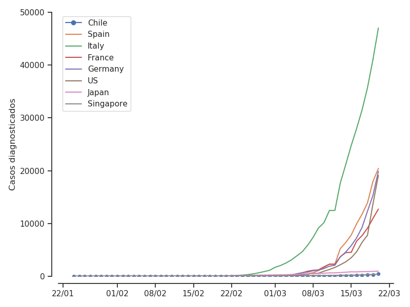
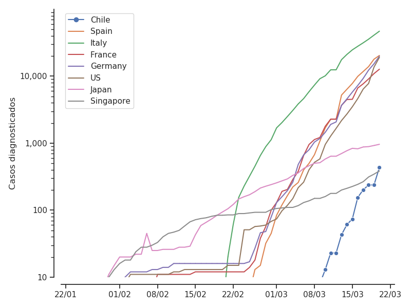
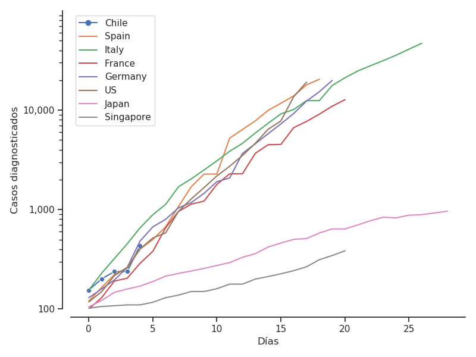

# Chile y el Coronavirus

El Presidente Piñera dijo en una entrevista que la situación Chilena era muy distinta a la de Italia, y que el país estaba mucho mejor preparado.
El Ministro de Salud Mañalich declaro que a lo mejor el virus podría volverse *bueno* y no afectar tanto a Chile.

Frente a la crisis sanitaria, es bueno **mirar los datos actuales** de la epidemia para entender mejor la situación chilena.

Para no sobrecargar los gráficos, elige solo algunos países del mundo, que me parecían representativo de las distintas tendencias de propagación, y en distintas etapas. Estos países son **España, Italia, Francia, Alemania, Estados Unidos, Japon y Singapore**. Excluí a China porque el contexto Chino es difícilmente comparable con Chile y otros países (las medidas que se tomaron en China probablemente no serían aplicables en otros países).

El primer graficó muestra directamente la evolución de la cantidad de casos diagnosticados en el tiempo.

Es difícil interpretar este grafico porque antes de final de Febrero, principio de Marzo, todas la curvas están muy cercana a 0, antes de despegar muy rápidamente. Este tipo de comportamiento es típico de las epidemias, y por eso son tan peligrosas. Por eso también decir que de momento hay menos muertos por el coronavirus que por la gripe estacional, por accidente de transito o por la represión del gobierno, no tiene sentido, porque una vez que empieza a subir, ya es demasiado tarde para reaccionar. A este comportamiento se le llama **exponencial**.

Para visualizar mejor la evolución, vamos a usar una escala **logaritmica** en el eje vertical. Es decir que la distancia entre dos graduaciones ya no es la misma, sino que va aumentando exponencialmente. Entre cada graduación la cantidad de casos será **multiplicada por 10**.

Ahora se aprecia mejor la evolución de la epidemia en cada país. **Lo importante no es tanto la cantidad de casos en este momento, pero la velocidad a la cual están aumentando los casos**. Eso se ve representado en el grafico por la **pendiente** de cada curva.

Para poder comparar aún mejor los países, lo ideal sería poder comparar la evolución desde que entró el virus al país. En la practica es difícil saber exactamente cuando llegó el virus, por lo cual vamos a tomar como día de referencia el día en lo cual cada país haya alcanzado al menos 100 casos. Así podemos *sincronizar* las curvas y comparar la evolución en cada país.

No todas la curvas alcanzan a llegar a la derecha del graficó. Eso solo significa que **algunos países llevan más tiempo en la epidemia que otros**. En Chile en particular solo han pasado 4 días desde que se hayan diagnosticado más de 100 personas enfermas. Sin embargo, queda muy claro que **Chile no esta mejor preparado que Italia, o que España, Francia, Alemania y Estados Unidos. Y si no se toman medidas sanitarias iguales o más fuertes que en estos países, la situación será igual o peor en algunos días más.**

Japon y Singapore son los únicos dos que tienen una propagación mucho más lenta, y son los ejemplos a seguir para evitar un desastre y decenas o centenas de miles de muertos en Chile.
